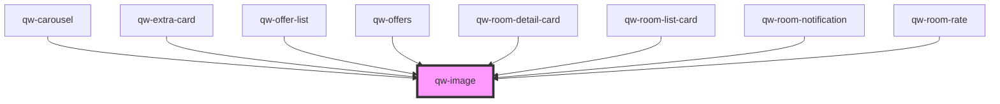

# qw-image

<!-- Auto Generated Below -->

## Properties

| Property                       | Attribute      | Description | Type      | Default     |
| ------------------------------ | -------------- | ----------- | --------- | ----------- |
| `qwImageAlt`                   | `qw-image-alt` |             | `string`  | `undefined` |
| `qwImageTransformationOptions` | --             |             | `Options` | `{}`        |
| `qwImageUrl`                   | `qw-image-url` |             | `string`  | `undefined` |

## Dependencies

### Used by

 - [qw-carousel](../qw-carousel)
 - [qw-extra-card](../../qw-extra/qw-extra-card)
 - [qw-offer-list](../../qw-offer-list)
 - [qw-offers](../../qw-offers)
 - [qw-room-detail-card](../../qw-room-detail/qw-room-detail-card)
 - [qw-room-list-card](../../qw-room-list/qw-room-list-card)
 - [qw-room-notification](../../qw-room-notification)
 - [qw-room-rate](../../qw-room-rate)

### Graph

----------------------------------------------

*Built with [StencilJS](https://stenciljs.com/)*
