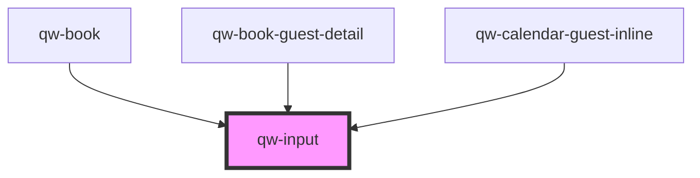

# qw-input

<!-- Auto Generated Below -->

## Properties

| Property             | Attribute               | Description | Type      | Default     |
| -------------------- | ----------------------- | ----------- | --------- | ----------- |
| `qwInputCaption`     | `qw-input-caption`      |             | `string`  | `undefined` |
| `qwInputHasError`    | `qw-input-has-error`    |             | `boolean` | `undefined` |
| `qwInputIsMandatory` | `qw-input-is-mandatory` |             | `boolean` | `undefined` |
| `qwInputIsReadonly`  | `qw-input-is-readonly`  |             | `boolean` | `undefined` |
| `qwInputLabel`       | `qw-input-label`        |             | `string`  | `undefined` |
| `qwInputName`        | `qw-input-name`         |             | `string`  | `undefined` |
| `qwInputType`        | `qw-input-type`         |             | `string`  | `undefined` |
| `qwInputValue`       | `qw-input-value`        |             | `string`  | `undefined` |

## Events

| Event            | Description | Type                          |
| ---------------- | ----------- | ----------------------------- |
| `qwInputChanged` |             | `CustomEvent<QwInputEmitter>` |

## Dependencies

### Used by

 - [qw-book](../../qw-book)
 - [qw-book-guest-detail](../../qw-book/qw-book-guest-detail)
 - [qw-calendar-guest-inline](../../qw-calendar-guest-inline)

### Graph

----------------------------------------------

*Built with [StencilJS](https://stenciljs.com/)*
