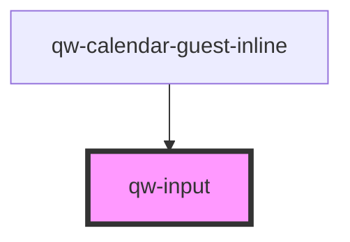

# qw-input

<!-- Auto Generated Below -->

## Properties

| Property            | Attribute              | Description | Type      | Default     |
| ------------------- | ---------------------- | ----------- | --------- | ----------- |
| `qwInputIsReadonly` | `qw-input-is-readonly` |             | `boolean` | `undefined` |
| `qwInputLabel`      | `qw-input-label`       |             | `string`  | `undefined` |
| `qwInputName`       | `qw-input-name`        |             | `string`  | `undefined` |
| `qwInputType`       | `qw-input-type`        |             | `string`  | `undefined` |
| `qwInputValue`      | `qw-input-value`       |             | `string`  | `undefined` |

## Dependencies

### Used by

 - [qw-calendar-guest-inline](../../qw-calendar-guest-inline)

### Graph

----------------------------------------------

*Built with [StencilJS](https://stenciljs.com/)*
