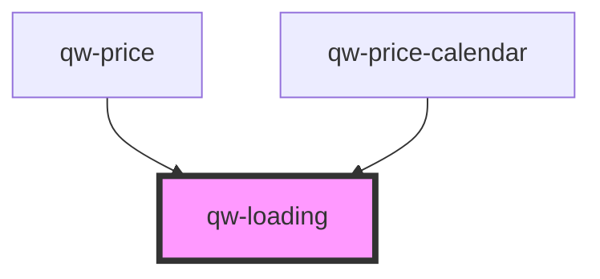

# qw-loading

<!-- Auto Generated Below -->

## Properties

| Property        | Attribute         | Description | Type     | Default     |
| --------------- | ----------------- | ----------- | -------- | ----------- |
| `QwLoadingSize` | `qw-loading-size` |             | `string` | `undefined` |

## Dependencies

### Used by

 - [qw-price](../../qw-price)
 - [qw-price-calendar](../../qw-price-calendar)

### Graph

----------------------------------------------

*Built with [StencilJS](https://stenciljs.com/)*
