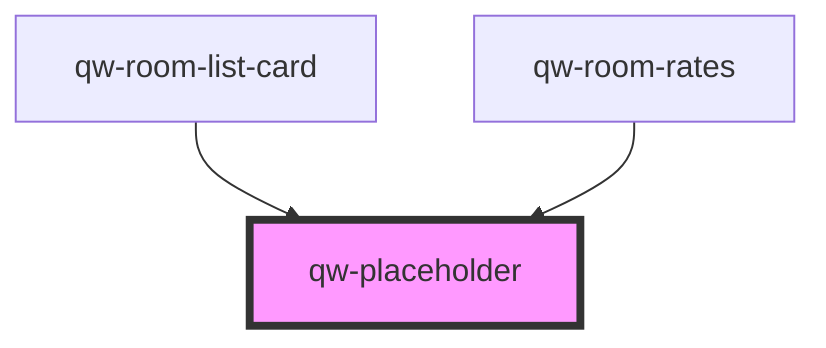

# qw-placeholder

<!-- Auto Generated Below -->

## Properties

| Property            | Attribute             | Description | Type                                                                  | Default                 |
| ------------------- | --------------------- | ----------- | --------------------------------------------------------------------- | ----------------------- |
| `qwPlaceholderType` | `qw-placeholder-type` |             | `QwRoomListType.Card \| QwRoomListType.Grid \| QwRoomListType.Inline` | `QwRoomListType.Inline` |

## Dependencies

### Used by

 - [qw-room-list-card](../../qw-room-list/qw-room-list-card)
 - [qw-room-rates](../../qw-room-rates)

### Graph

----------------------------------------------

*Built with [StencilJS](https://stenciljs.com/)*
