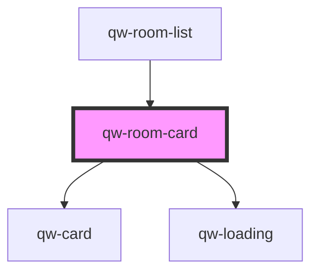

# qw-room-card

<!-- Auto Generated Below -->

## Properties

| Property                 | Attribute                   | Description | Type         | Default     |
| ------------------------ | --------------------------- | ----------- | ------------ | ----------- |
| `qwRoomCardAvailability` | `qw-room-card-availability` |             | `number`     | `undefined` |
| `qwRoomCardBeds`         | `qw-room-card-beds`         |             | `string`     | `undefined` |
| `qwRoomCardGuests`       | `qw-room-card-guests`       |             | `string`     | `undefined` |
| `qwRoomCardImage`        | `qw-room-card-image`        |             | `string`     | `undefined` |
| `qwRoomCardIsLoading`    | `qw-room-card-is-loading`   |             | `boolean`    | `undefined` |
| `qwRoomCardOnClickBook`  | --                          |             | `() => void` | `undefined` |
| `qwRoomCardPrice`        | `qw-room-card-price`        |             | `string`     | `undefined` |
| `qwRoomCardRates`        | --                          |             | `Rate[]`     | `undefined` |
| `qwRoomCardTitle`        | `qw-room-card-title`        |             | `string`     | `undefined` |

## Dependencies

### Used by

 - [qw-room-list](../../qw-room-list)

### Depends on

- [qw-card](../qw-card)
- [qw-loading](../qw-loading)

### Graph

----------------------------------------------

*Built with [StencilJS](https://stenciljs.com/)*
