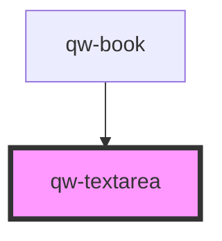

# qw-textarea

<!-- Auto Generated Below -->

## Properties

| Property          | Attribute           | Description | Type     | Default     |
| ----------------- | ------------------- | ----------- | -------- | ----------- |
| `qwTextareaName`  | `qw-textarea-name`  |             | `string` | `undefined` |
| `qwTextareaValue` | `qw-textarea-value` |             | `string` | `undefined` |

## Events

| Event               | Description | Type                          |
| ------------------- | ----------- | ----------------------------- |
| `qwTextareaChanged` |             | `CustomEvent<QwInputEmitter>` |

## Dependencies

### Used by

 - [qw-book](../../qw-book)

### Graph

----------------------------------------------

*Built with [StencilJS](https://stenciljs.com/)*
